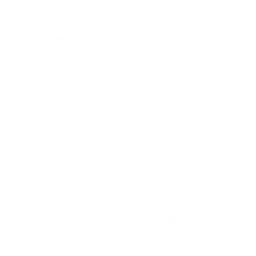

<p align="center">
  <picture>
    <source media="(prefers-color-scheme: dark)" srcset="./src/assets/white_knight_icon.png">
    <source media="(prefers-color-scheme: light)" srcset="./src/assets/black_knight_icon.png">
    
  </picture>
</p>

<center>

# MCP Defender

## Automatically protects MCP traffic in AI apps

[](https://github.com/MCP-Defender/MCP-Defender)
[](https://discord.gg/SqXz6RGU)
[](https://x.com/MCPDefender)
[](LICENSE)

</center>

🛡️  MCP Defender is a desktop application that automatically protects your computer from malicious MCP traffic.

🚦 All MCP tool call requests and responses from AI apps like Cursor, Claude and Windsurf are automatically proxied through MCP Defender.

🔎  The intercepted data is then checked against security signatures - if anything harmful is detected, MCP Defender will alert you and ask if you want to allow or block the tool call from proceeding.

# Quick Start

[Download MCP Defender for Mac](https://mcpdefender.com)

Windows & Linux Coming Soon

Alternatively you can clone the git repo, and run it as follows:

```bash
# Install dependencies
npm install

# Start app
npm start
```
# Demos

## Contributing

We love contributions! Feel free to open issues for bugs or feature requests.

## License

MCP Defender is [Apache 2.0 licensed](LICENSE).
